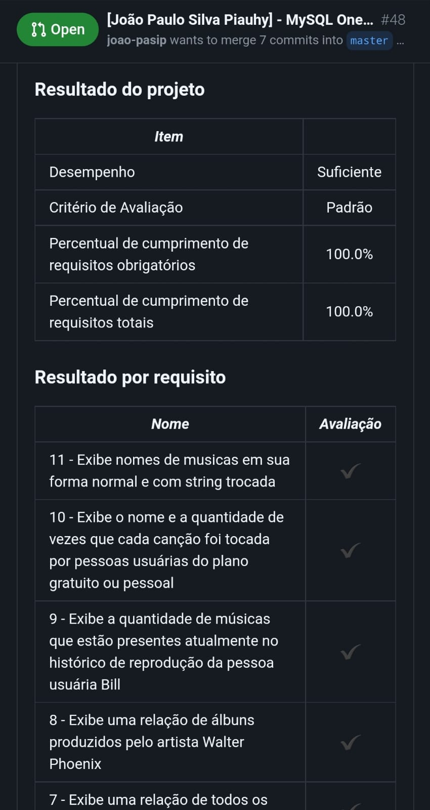

# Projeto One For All

Nesse projeto eu normalizei e populei uma tabela na terceira forma normal e acessei as informações desta tabela através de `queries` utilizando `SQL`. Meu trabalho foi referente aos entregáveis listado logo abaixo nesse Readme.

## 🛠 Habilidades
Trabalhar com os conceitos de SQL, conhecer as ferramentas como DBeaver, Extensão VSCode MySQL e Workbench para a manipulação das queries, normalizar e popular uma tabela.

## Utilização

- Para clonar o projeto: `git clone git@github.com:joao-pasip/Projeto-OneForAll.git`.

- Já existe um arquivo `docker-compose.yml` disponibilizado pela Trybe, no entanto rodei o meu `Docker` do MySQL para executar esse projeto.

- Nesse projeto utilizei o DBeaver para criar o banco de dados e executar minhas queries. Como também usei a extensão do VSCode MySQL para desempenhar praticamente a mesma funcionalidade do DBeaver, só a título de testar e conhecer mais ferramenta.

## Entregáveis

Recebemos algumas tabelas, sendo elas: usuários(e, suas informações), albuns(e, suas informações) e uma terceira que mostrava qual usuário tinha favoritado qual artista no excel, assim tínhamos que normalizar para a 3ª Forma Normal e desenvolver `queries` para visualização de informações da tabela, inclusive, implementando os JOIN's.

## Considerações finais

Um projeto feito para aprender normalização e população de tabelas, fixar conceito de SQL, trabalhar com as ferramentas como: `DBeaver`, `Extensão VSCode MySQL` e `Workbench` que fazem essa manipulação nas tabelas do banco de dados através das `queries` que desenvolvemos solidificando o nosso conhecimento. Entendimento sobre os `JOIN's` e particularidades dos `relacionamentos` entre `tabelas`, além disso ter a experiência de executar o meu `Docker` do MySQL para a realização desse projeto.

